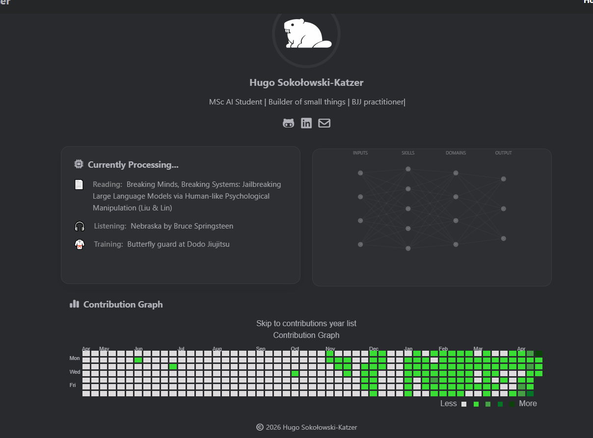

You are starting a work session on the Weles project. Follow these steps exactly, in order. After completing one issue, loop back to Step 1 and pick up the next unblocked issue. Continue looping until you hit a usage limit or there are no more unblocked issues.

---

## Step 1 — Status check

Run these in parallel:
- `gh pr list --repo RAGNAROS-HS/Mushin --state open` — open PRs (in-progress work)
- `gh issue list --repo RAGNAROS-HS/Mushin --state open --limit 50` — open issues

Then check which open issues are **unblocked**: an issue is unblocked when all issues listed in its "Dependencies:" line are closed. To check an issue's dependencies, read its body via `gh issue view {number} --repo RAGNAROS-HS/Weles`.

Present a concise status report:

```
Open PRs (in progress):
  #N  branch-name  "PR title"

Next unblocked issues:
  #N  "Issue title"  [labels]
  #N  "Issue title"  [labels]
  ...

Suggested next issue: #N — "title"
Reason: lowest unblocked issue; all dependencies closed.
```

If there is an open PR with no unresolved issues blocking it, merge it first (Step 5), then re-check for the next unblocked issue. Pick up the suggested (lowest-numbered unblocked) issue automatically and proceed to Step 2.

---

## Step 2 — Read the issue

1. Run `gh issue view {number} --repo RAGNAROS-HS/Weles` to read the full issue body.
2. Read `CLAUDE.md` for any rules that apply to this issue.
3. If the issue modifies the API, read `docs/api.md`. If it touches core patterns, read `docs/architecture.md`.
4. State back in one short paragraph: what you're about to build, the key constraints, and what tests you'll write. No hand-waving — be specific.

Proceed immediately to Step 3 — do not wait for confirmation.

---

## Step 3 — Implement

1. Create branch: `git checkout -b feat/issue-{N}-{slug}` where slug is 3–5 words from the title, hyphenated.
2. Implement the acceptance criteria from the issue — nothing more. Do not refactor adjacent code.
3. Write the tests listed under "Tests shipped with this issue".
4. Update docs:
   - `CHANGELOG.md` — add entries under `[Unreleased]` in the correct milestone section.
   - `docs/api.md` — if any endpoint was added or changed.
   - `docs/architecture.md` — if any core pattern, module, or invariant changed.
5. Run `uv run ruff check src/ tests/ && uv run ruff format --check src/ tests/ && uv run mypy src/` for lint, and `uv run pytest tests/ -q` for tests. Fix any failures before continuing. Do not skip or suppress.

---

## Step 4 — Create the PR

1. Stage and commit all changes:
   - Commit message format: `feat: #N {issue title}` (subject ≤72 chars)
   - Body only if the why isn't obvious from the title.
2. Push the branch: `git push -u origin feat/issue-{N}-{slug}`
3. Create the PR:
   - Title: `feat: #N {issue title}`
   - Body: fill out `.github/pull_request_template.md` — acceptance criteria checklist items checked off, docs checkboxes checked, notes on anything non-obvious.
   - Use `gh pr create --repo RAGNAROS-HS/Weles --title "..." --body "..." --base main`
4. Output the PR URL.

---

## Step 5 — Adversarial self-review, merge, and loop

### 5a — Adversarial self-review

Fetch the diff: `gh pr diff {N} --repo RAGNAROS-HS/Weles`

Review it as an adversary — look for:
- Correctness bugs (off-by-one, wrong comparison, missing null check)
- Security issues (injection, unvalidated input at system boundaries)
- Broken invariants documented in CLAUDE.md or architecture.md
- Missing test coverage for the acceptance criteria

Post findings as a PR comment: `gh pr comment {N} --repo RAGNAROS-HS/Weles --body "..."`

For each CRITICAL or WARNING finding: fix it, re-run lint and tests, commit as `fix: address adversarial review issues on PR #{N}`, push.

Dismiss false positives and style suggestions with a brief reason in the comment — do not fix them.

### 5b — Merge

After any fixes are pushed, merge the PR:

```
gh pr merge {N} --repo RAGNAROS-HS/Weles --squash --delete-branch
```

Then sync main locally:

```
git checkout main && git pull origin main
```

### 5c — Loop

Go back to **Step 1** and pick up the next unblocked issue. Repeat until there are no more unblocked issues or a usage limit is reached.
