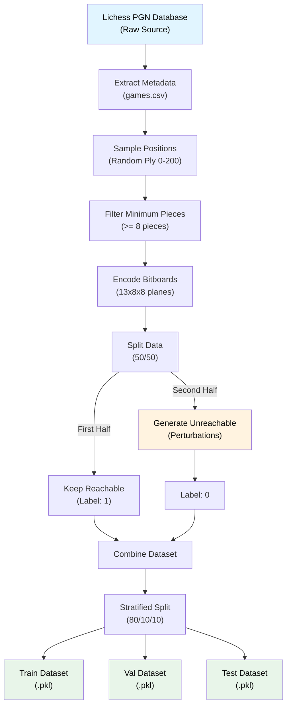

# Simurgh

## Overview

I know what you are thinking — "oh no, not another chess project." But hear me out. 

While lots of work is dedicated to evaluating positions or legal moves, **I have yet to see a project evaluating possibilities**. 

Chess grandmasters can look at a board and (to some extent) determine whether such a game could exist. Their experience and pattern recognition allow them to assess whether a board state is **possible**. The distinction between **legal** and **possible** is crucial here.

> **Key Insight:** A state can be legal but unreachable. For example, a specific pawn structure might follow all the rules of chess, but given the turn number, there's no possible sequence of moves that could produce this arrangement.

**Core Challenge:** Can I create a system that accurately classifies whether a given board state is reachable?

## Problem Statement

| Aspect         | Details                                                                                                      |
| -------------- | ------------------------------------------------------------------------------------------------------------ |
| **Task**       | Binary classification - Determine if a chess board state is possible or unreachable                          |
| **Scope**      | Identify states that are legal but unreachable (not structural illegality such as improper number of pieces) |
| **Key Inputs** | Board state, Turn number                                                                                     |

---

## Related Work

There exist approaches close to what I'm looking for, most notably- retrograde analysis, where mathematically one searches and computes for a sequence of moves to reach a given board state. However this is not computationally possible beyond around 25 turns. A similar story can be seen on the other end of the spectrum - chess endgames are a mature area of research, and chess is considered "solved" when there are 7 or fewer pieces on the board, that is not to say there do not exist unreachable arrangements with such piece counts, but my paper will not delve into this area, but rather seek to ammend the mid game gap between these two fields.

The problem as a whole is PSPACE-complete. A learned approximator cuts out the long computational process for each check that the standard retrograde analysis methods use.

### Existing Approaches
- **Retrograde Analysis** - Focuses on pawn structure analysis
- **Proof Games** - Generates a history of how a game reached a position (computationally infeasible at scale)
- **Exhaustive Search** - Mathematical methods that search all possible game arrangements (again - computationally infeasible at scale)

### Key Resources

**External Links:**
- [Natch Proof Game Solver](http://natch.free.fr/Natch.html)
- [Texel Proof Game Documentation](https://github.com/peterosterlund2/texel/blob/master/doc/proofgame.md)
- [Chess Neural Networks Research](https://theses.liacs.nl/pdf/2022-2023-AlwerSaleh.pdf)
- [Problem Size Estimation](https://univ-avignon.hal.science/hal-03483904)
- [Chess 960 Lichess Dataset](https://www.kaggle.com/datasets/alexmolas/chess-960-lichess) - All back row pieces randomized at start
- [ChessPositionRanking](https://github.com/tromp/ChessPositionRanking) - Interesting relevant repo with heuristic-based legality checker

**Background Papers**
- [Alwer Saleh Thesis (2022-2023)](/pdfs/2022-2023-AlwerSaleh.pdf)
- [Chess Position Evaluation Using Radial Basis Function](/pdfs/Chess_Position_Evaluation_Using_Radial_Basis_Funct.pdf)
- [CNN Topologies](/pdfs/CNNTOPO.pdf)
- [ConvChess](/pdfs/ConvChess.pdf)
- [End-to-End Learning](/pdfs/endToEnd.pdf)
- [ImageNet Classification](/pdfs/IMAGENET.pdf)
- [Postprint Research](/pdfs/postprint.pdf)
- [ResNet Architecture](/pdfs/ResNET.pdf)
- [Retrograde Analysis](/pdfs/retrograde.pdf)
- [Retrograde Complexity](/pdfs/retrogradeComplexity.pdf)
- [Vanishing Gradient Problem](/pdfs/vanishingGradient.pdf)
- [VGG Architecture](/pdfs/VGG.pdf)

### Problem Complexity Estimates

We know unreachable boards exist, but just how many are there? Thankfully others have calculated this, giving us a good picture of the scale.

| Estimate                                   | Value        | Notes                                   |
| ------------------------------------------ | ------------ | --------------------------------------- |
| Shannon's piece-count-respecting estimate  | ~4.63 × 10⁴² | Correct piece types, ignores illegality |
| Legal diagrams (upper bound, no promotion) | ~4 × 10³⁷    | Gourion's result                        |

Meaning there are roughly 100 000 times more possible boards than reachable boards

## Dataset

| Type                   | Source                  |
| ---------------------- | ----------------------- |
| **Possible states**    | lichess dataset         |
| **Unreachable states** | synthetically generated |

Lichess has an enormous amount of data, more than I could ever hope to process, for this project I have taken one single month of the lichess dataset, and processes 100k games. The reasoning for this number will be clear later.

### Unreachable States Generation

Apply perturbations to **reachable** positions (e.g. from simulated or real games) to produce synthetic unreachable states. Core perturbation ideas by category:

#### 1. Pawn structure

- **Pawn swap** — Swap two same-color pawns on different files (breaks file history).
- **Double pawn** — Copy a pawn to an adjacent file so two same-color pawns share a file.
- **Pawn teleport** — Move a pawn to another file or rank without a legal path (e.g. e2→e5 in one step).
- **Wrong count / placement** — Add/remove pawns, or put a pawn on rank 1/8 (without promotion), or create impossible passed/blocked structures.

#### 2. Turn number

- **Turn truncation** — Take a position from move 40 and label it as move 10 (or 5); many arrangements are impossible that early.
- **Turn inflation** — Label an early-looking position (e.g. many pawns, few pieces moved) as move 60.
- **Minimum-move violation** — Set turn number below the minimum moves needed (e.g. for knights to leave the back rank, or for the given piece layout).

#### 3. Piece mobility / placement

- **Knight jump** — Move a knight to a non-knight square.
- **Bishop colour** — Put a bishop on the wrong colour complex.
- **King in check (illegal last move)** — Add or move a piece so the side not to move has their king in check.

### Alternative Approaches

A potential alternative is simulated chess variant games, for example chess 960 which randomizes the back row. These would naturally tend towards states unreachable in regular chess, however these is no guarantee that for example a crazyhouse chess game state would not be reachable via normal chess play. So this approach is falling to the way side in terms of priority.

Knowing our dataset and approach we can sketch out our data flow

## Data Pipeline

### Pipeline Details

Since I want to train a Neural Network, and lichess downloads in PGN format, I need to make some transformations for the board states to be visible. First of all there is a lot of metadata we do not need, so we strip those, then as PGN is simply a list of moves, we need to pick a turn number and progress towards it. Usually this would result in a FEN file-type, but this is suboptimal for NN training. After skimming some papers it seems like a bitmap is the best representation, some systems like AlphaZero use a 6 channel bitmap - essentially being colorblind and assuming the board is always rotated to the player, but I want my NN to distinguisg between colors, as I'd imagine that gives better depth of understanding and recognition. Also at this stage it needs to be decided how to split the dataset, to the best of my understanding a 50/50 split is ideal, so this is what I aim for, also the pertubed half is further evenly split between the various types. All of this as a whole is divided into 80 10 10 for train test val, as our data quantity is not an issue we do not need cross validation or folds.

So to summarize:

1.  **Source**: Large scale PGN databases from Lichess.
2.  **Metadata Extraction**: Key attributes (Elo, Result, Moves) are extracted to `games.csv` for distribution analysis.
3.  **Position Sampling**: For each game, a random ply is selected between 0 and 200. Positions with fewer than 8 pieces are rejected (or walked back) to ensure meaningful mid-game content.
4.  **Bitboard Encoding**: Positions are converted into a `13x8x8` numpy array:
    -   12 planes for piece types and colors (White/Black P, N, B, R, Q, K).
    -   1 plane for normalized turn number (`ply / 400`).
5.  **Labeling & Balancing**: 
    -   The dataset of reachable bitboards is split exactly in half (50/50).
    -   The first half is kept identical as **Reachable** (Label 1) and assigned a perturbation type of `none`.
    -   The second half is selectively perturbed to create **Unreachable** states (Label 0), ensuring the foundational board characteristics (like average Elo or piece count origins) perfectly mirror the reachable dataset.
    -   Crucially, each unreachable state also tracks its origin modifier as a `perturbation_type` sub-label for evaluation analysis.
6.  **Dataset Splits**: The combined data is split into **Training (80%)**, **Validation (10%)**, and **Testing (10%)** sets using a stratified approach to maintain the 50/50 reachability ratio across all splits.
7.  **Storage**: Datasets are serialized using `pickle` to preserve numpy array structures in `datasets/`.

### Dataset Distributions

To understand and double check the characteristics of our training data, we can view its distributions regarding piece count, game length, and player skill.

  
  
  

<b>Click to view detailed Reachable vs Unreachable dataset splits</b>

 

**Piece Count**

  
  

**Number of Moves**

  
  

**Average Elo**

  
  

 

The synthetic unreachable data is generated by randomly selecting from our list of perturbations, resulting in the following distribution amongst the unreachable dataset portion:

  

---

## Neural Network Architecture

The project uses a custom Convolutional Neural Network inspired by the ResNet-20 architecture, specifically adapted for the spatial dimensions of a chess board. The model processes the 13-channel bitboard to learn deep spatial features and piece relationships. The reason behind selecting this model is the following - data is not an issue, I am able to feed as many games as necessary to propagate an incredibly deep network. I find this depth necessary as the impossiblities are "hidden" in the sense that they are not immediately obvious, and require a deep "understanding" of chess to detect. VGG's are deep, but require many more parameters, ResNet maintains the depth while staying relatively small. I'm sure this topology is not the only valid one, but for the literature I've read, it seems to be a good starting point.

### Topology Specifications

| Component        | Specifications                                         | Output Resolution |
| :--------------- | :----------------------------------------------------- | :---------------- |
| **Input**        | 13 channels (12 piece types + 1 turn number), 8x8 grid | 13×8×8            |
| **Initial Conv** | 16 filters, 3×3, stride 1, BN, ReLU                    | 16×8×8            |
| **Stage 1**      | 3 ResNet blocks (16 filters, stride 1)                 | 16×8×8            |
| **Stage 2**      | 3 ResNet blocks (32 filters, stride 2 downsampling)    | 32×4×4            |
| **Stage 3**      | 3 ResNet blocks (64 filters, stride 2 downsampling)    | 64×2×2            |
| **Classifier**   | Global Average Pooling, Dense (2 units, Softmax)       | 2                 |

#### ResNet Block Structure
Each standard residual block applies:
1. Convolution (3×3, padding "same")
2. Batch Normalization & ReLU
3. Convolution (3×3, padding "same")
4. Batch Normalization
5. Skip Connection Addition
6. ReLU

*Note: For blocks that reduce dimensions between stages (stride=2), the skip connection applies a 1×1 convolution with stride 2 and Batch Normalization to match the new filter count and spatial size.*

## Results & Evaluation

Simurgh successfully trained (albeit not for the full 30 epochs) and achieving an overall **ROC AUC Score of 0.9959**. This result is at a glance extremely promising, so lets take a look to verify.

### Training Performance

  
  

Our training metrics look rock solid, however our validation scores are sawtooth shaped, implying the learning rate was too high or the set was too small. There might be some performance left on the table due to this, so definitely a worthy lesson for next time

### Per-Perturbation Analysis

Below is a breakdown of the accuracy for each specific problem type.

| Category           | Perturbation Type     | Count |  Accuracy  |
| :----------------- | :-------------------- | :---: | :--------: |
| **Baseline**       | None *(Reachable)*    | 4987  | **98.24%** |
| **Pawn Structure** | Capture Contradiction |  327  | **99.69%** |
|                    | Rank Violation        |  643  | **99.38%** |
|                    | Excess Pawns          |  621  | **98.55%** |
| **Turn Number**    | Turn Inflation        |  858  | **99.77%** |
|                    | Turn Truncation       |  854  | **96.84%** |
| **Mobility**       | Impossible Promotion  |  586  | **95.22%** |
|                    | Bishops Same Color    |  559  | **93.20%** |
|                    | Illegal Check         |  540  | **87.04%** |

#### Key Insights

1. **Pawn Structure Violations are Obvious:** The network is almost flawless (>98.5%) at noticing impossible pawn configurations, such as pawns sitting on the 1st or 8th rank, contradictory captures needed to reach the file arrangement, or excess pawns. The spatial nature of convolutional networks handles this exceptionally well. 
2. **Turn Flow Awareness:** The network has successfully learned to correlate the number of pieces missing and typical piece development with the given turn number dimension. Identifying *Turn Inflation* (an overly high turn number given the crowded board) is near-perfect (99.77%). *Turn Truncation* (too few turns for the amount of development/captures) is also highly accurate (96.84%).
3. **Complex Mobility is The Hardest:** Detecting structural impossibilities that require deep backward-logical deduction—such as realizing an *Illegal Check* sequence (87.04%) or spotting *Bishops on the Same Color* (93.20%)—is the model's weakest point. While accuracy is still impressively high, this highlights the difference between learning localized structural rules versus long-term procedural legality.

There are some things to note here - one could potentially tweak the severity of these peturbations, for example lowering the amount of turns that we truncate or inflate. The reason behind the high values in this project is to ensure impossibility, if one were to delve into less and less obvious peturbations, a source of truth via a retrograde analysis would be necessary.

#### Prediction Confidence Distributions

We can visualize the model's prediction confidence spread for each specific type of data (0.0 = completely confident it's Unreachable, 1.0 = completely confident it's Reachable).

<b>Click to view prediction distribution plots for each perturbation type</b>

 

**Baseline (Reachable)**
 

**Pawn Structure**

  
  
  

**Turn Number**

  
  

**Mobility**

  
  
  

#### Ply vs Confidence

By mapping the prediction confidence over the course of the turn number (ply), we can see how the model's certainty evolves as games go deeper.

  

Specifically, observing the Turn Number perturbations shows how the model handles states with incorrect turn numbers over the progression of a match.

  
  

### Aggregate Evaluation Metrics

To visualize the model's holistic performance, the confusion matrix and overall metrics distributions summarize its test set precision, recall, and decision boundaries.

  

---

This just about concludes the project, many precise details and decisions were not included in this description, doing that would balloon the document to thesis-size. For now this is not on my radar, but maybe eventually I'll get around to formatting it in latex and providing a fully fledged description.

Whatever the case - I think I've taken an interesting step into tackling a niche problem using an industry standard - but previously unatempted (in this realm) solution. All with solid results, and room for future improvement.

## Potential Future Goals
- [ ] Turn into Latex doc
- [ ] Create a web interface for position evaluation
- [ ] Deploy as a hosted website for public access

---

> Author: Hugo Sokołowski-Katzer  
> URL: http://localhost:1313/projects/simurgh/  

